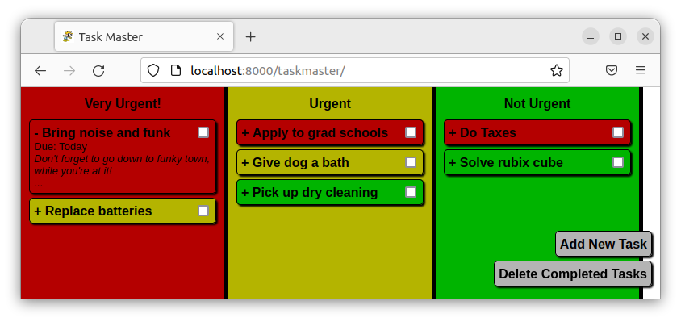
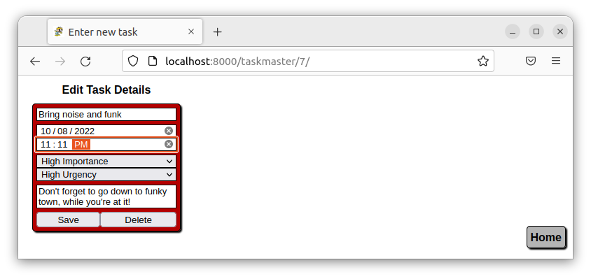
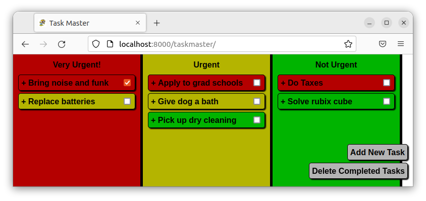
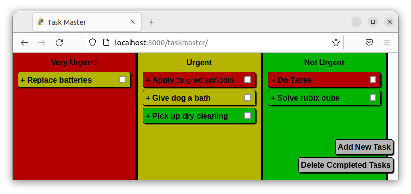
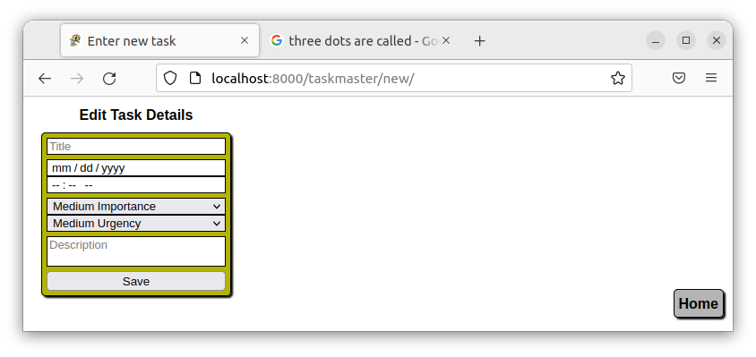

# Task Master

[](https://github.com/RichardLitt/standard-readme)


Task Master is a task management software created by Spiff Industries for standard desktop browsers.  It allows the user to easily create, edit, and check off tasks that can be optionally descriptive.  The level of detail is up to the user.  It employs the principles of importance and urgency as described in [*The 7 Habits of Highly Effective People&#174;*](https://www.franklincovey.com/the-7-habits/) by Steven Covey.  This software attempts to bring that system of efficiency to the 21st century.

## Table of Contents

- [Background](#background)
- [Install](#install)
- [Usage](#usage)
- [Contributing](#contributing)
- [License](#license)
- [Acknowledgements](#acknowledgments)

### Background

TaskMaster was released as an [Android app on Google Play](https://play.google.com/store/apps/details?id=com.rsquared.taskmaster&hl=en&gl=US) in 2020.  It was not successful and had many development problems that made it difficult to create new versions.  Although visually appealing, the tasks themselves had too much granularity for importance and urgency to make it practical.  This version of TaskMaster attempts to simplify the process and broaden the market.  Future versions of TaskMaster will introduce the use of cookies and user accounts and be deployed on the spiffindustries.com AWS server.  Once that release is stable, the next version will introduce Android and iPhone apps that can employ the same user accounts.

## Install

### Django Installation

If you are new to **Django**, please refer to [https://docs.djangoproject.com/en/4.1/intro/](https://docs.djangoproject.com/en/4.1/intro/) and follow the instructions for creating a site and a project.  More experienced users simply need to create a ``TaskMaster`` project in their **Django** site folder and download all the project files to that folder.  The exact procedure will depend on the operating system used and is covered in detail in the above link.  **Gunicorn** is recommended for production.

### Database setup

The database used for development was **MySQL**, but **Django** is set up in such a way that different databases could be used for the same model.  The important thing is that the ``settings.py`` file in your **Django** site is set up with database access, regardless of the system you use.  Before running the **Django** server, the user must migrate the database.  Specific instructions are available in [this tutorial](https://docs.djangoproject.com/en/4.1/intro/tutorial02/) and in the example setup below.

### Example setup

The following is an example setup for running the TaskMaster **Django** project on a Linux server.  This set of instructions assumes successful installation of **Python**, **pip**, and a database engine to be determined by the user.
* Depending on your folder and setup, you may have to add the `sudo` keyword to these commands and/or use `python3` instead of `python`

As mentioned above, you will have to configure your database.  Specifically, you must add a database to your schema that is dedicated solely to the **Django** project (including all **Django** apps) and add a user that has full permissions to that database whose password you don't mind adding to a local text file.

Install Django:
```
python -m pip install Django
```
Create a Django project:
```
django-admin startproject mysite
```
Open the settings file:
```
nano mysite/settings.py
```
Change the following:
1. Add the TaskMaster app to the list of installed apps
1. Configure the database
1. Change the timezone

Scroll down to the list of installed apps:
```
INSTALLED_APPS = [
    'django.contrib.admin',
    'django.contrib.auth',
    'django.contrib.contenttypes',
    'django.contrib.sessions',
    'django.contrib.messages',
    'django.contrib.staticfiles',
]
```
Add the line ``'taskmaster.apps.taskmasterConfig'`` so it now reads:
```
INSTALLED_APPS = [
    'taskmaster.apps.taskmasterConfig',
    'django.contrib.admin',
    'django.contrib.auth',
    'django.contrib.contenttypes',
    'django.contrib.sessions',
    'django.contrib.messages',
    'django.contrib.staticfiles',
]
```
Scroll down to the databases portion, which should read something like:
```
DATABASES = {
    'default': {
        'ENGINE': 'django.db.backends.mysql', 
        'NAME': 'DB_NAME',
        'USER': 'DB_USER',
        'PASSWORD': 'DB_PASSWORD',
        'HOST': 'localhost',   # Or an IP Address that your DB is hosted on
        'PORT': '3306',
    }
}
```
For this portion, you must determine your own database setup.  Whatever engine you use, it is important that you create a **Django** database and enter the database name and credentials in the above settings for a successful connection.  See [this](https://docs.djangoproject.com/en/4.1/topics/install/#database-installation) for more information.

Scroll down to the timezone setting:
```
TIME_ZONE = 'UTC'
```
Find your [timezone code](https://en.wikipedia.org/wiki/List_of_tz_database_time_zones) and substitute it for ``'UTC'`` so it now reads something like:
```
TIME_ZONE = 'America/New_York'
```
Create the taskmaster app:
```
python manage.py startapp taskmaster
```
Download the TaskMaster project and add the files:
```
cd mysite/taskmaster
rm -r *
git clone https://github.com/rbrutherford3/Task-Master.git .
```
Prepare the TaskMaster database model:
```
python manage.py makemigrations taskmaster
```
Set up the database:
```
python manage.py migrate
```
Run the server:
```
python manage.py runserver
```
Open your browser and navigate to ``localhost:8000/taskmaster`` (or ``127.0.0.1:8000/taskmaster``)

## Usage

Go to TaskMaster in your browser

Click/tap a task's text to see details

Click/tap the ellipses to edit the task.

Click/tap "Save" to modify that task (or "Delete" to remove it)

Click/tap the checkbox to indicate that a task is complete

Click/tap "Delete Completed Tasks" to purge all tasks that are finished but still visible (note: this will permanently delete the tasks)

Click/tap "Add New Task" to create another one


## Contributing

Contributions are welcome, including any feedback.  Please contact rbrutherford3 on GitHub.

## License

[MIT © Robert Rutherford](../LICENSE)

## Acknowledgments

* Thanks to my parents for everything
* Thanks to my sister for this computer
* Thanks to Colby Sainato for actually looking at this